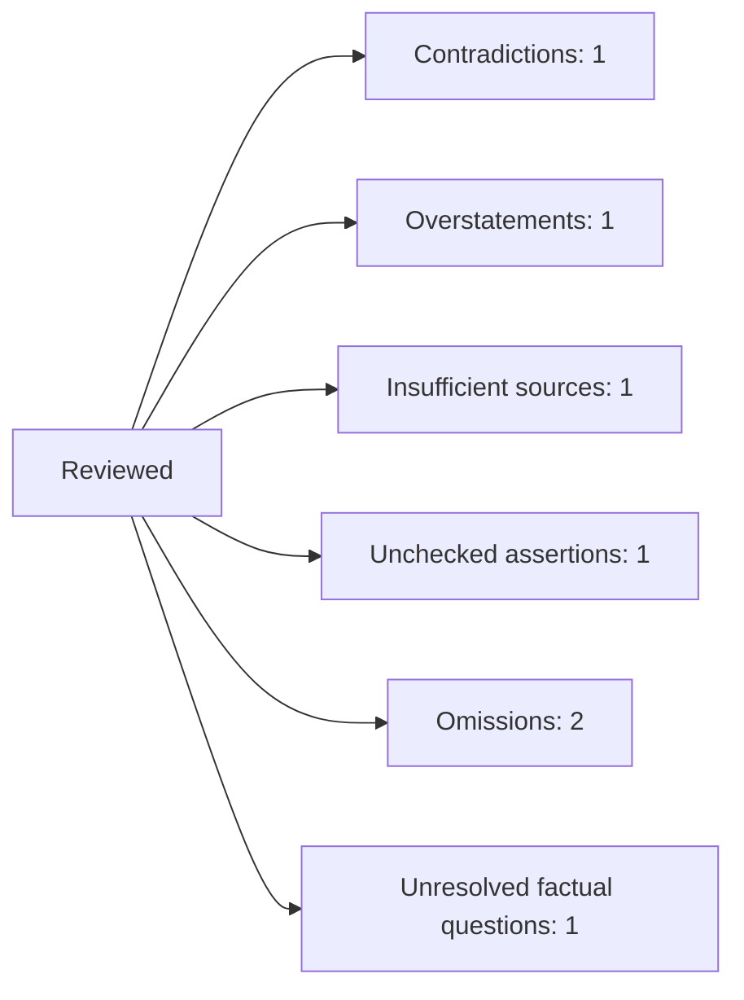

# Review Identity

Target and all five source hashes are recorded. Methods actually used were
original-recording observation review, transcript review, authority review,
control comparison, and prior-report comparison. [cite:RECORDING]
[cite:TRANSCRIPT] [cite:AUTHORITY] [cite:CONTROL] [cite:PRIOR-REPORT]

# Assertion Records

- `A-001` is a contradiction: “Plaintiff submitted” changes Alder’s recorded
  command into voluntary conduct the source does not establish. Corrective
  action: restore source-bounded command language. [cite:RECORDING]
- `A-002` is an overstatement if the draft claims native-audio review. The
  reviewed method was transcript review; no listening method is claimed.
  [cite:TRANSCRIPT]
- `A-003` is a supported inference only if its premise facts and reasoning are
  stated. It is not personal knowledge.
- `A-004` has an insufficient source: the authority concerns traffic-stop
  duration and does not support the arrest-command proposition. [cite:AUTHORITY]

# Requirement Coverage

- `C-001` is an omission: approved Count II is absent.
- `C-002` is an omission: the principal detention-duration correction is absent.
  [cite:CONTROL]
- `U-001` is an unresolved factual question with authorized treatment: Roe may
  remain a Doe. Unknown status alone is not a defect. [cite:CONTROL]

# Status Register

Supported assertions: 0. Supported inferences: 1. Contradictions: 1.
Overstatements: 1. Insufficient sources: 1. Missing documentation links: 0.
Unchecked assertions: 1 stale assertion. Omissions: 2. Unresolved factual
questions: 1.

# Freshness

`A-005` is stale because the assertion text changed after the prior review. Its
old pass and dependent conclusions require revalidation. [cite:PRIOR-REPORT]

# Mermaid Summary

# Stopping Decision

Validation is incomplete. Correction must occur separately, followed by
affected-assertion and dependency revalidation and final whole-document review.
