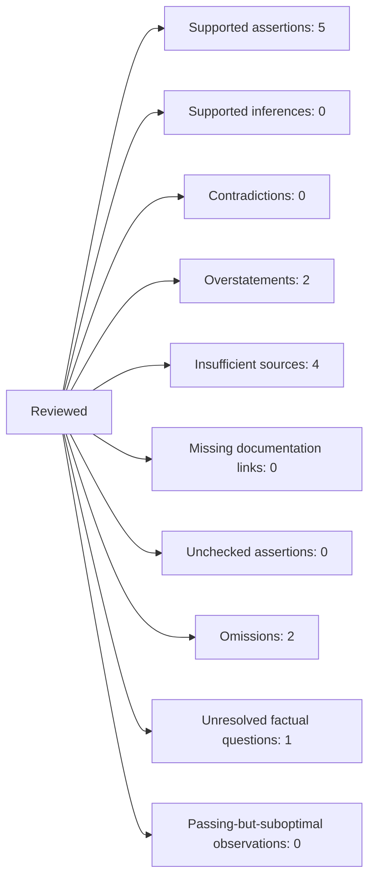

# Review Identity

- Skill: `validating-court-facing-assertions`, fixture version 1
- Quality-control kind: post-draft assertion validation
- Run: `00000000-0000-4000-8000-000000000001` at 2026-09-08T00:00:00Z
- Reviewed commit: synthetic unversioned fixture
- Target: role `filing`, relative path `target-draft.md`, byte size 348,
  602167fa176b1c89d1e5ee8dec06331027707f7e3d89a326c60748cc6b401efc [cite:TARGET]
- Source ID RECORDING: role `record`, relative path `recording-observation.md`,
  49bf40a77ffe7de4bfd07b68b96bb48f0fd3dc0bf1e5e31da27d6c6744452905
  [cite:RECORDING]
- Source ID TRANSCRIPT: role `record`, relative path `transcript.md`,
  71ac073dc9b1c002ef2e470e86a9412018151028785ba46dcd08899b61d757bd
  [cite:TRANSCRIPT]
- Source ID AUTHORITY: role `authorities`, relative path `authority.md`,
  3c97ff81c7bff9e0d620463411bedad223573178e1f8dd1ef39fbf1f78804ec1
  [cite:AUTHORITY]
- Source ID CONTROL: role `strategy`, relative path `control.md`, version
  synthetic-current-1,
  eb16819e932faf5b78a497bf1893f22a8fafc36043a748288e64199b6f0df3b3
  [cite:CONTROL]
- Source ID PRIOR-REPORT: role `prior-reports`, relative path `prior-report.md`,
  ad0a4936acbc50ad868b64a34dc58a9a210baf89e1f433e7fee44b24b00a5101
  [cite:PRIOR-REPORT]
- Source ID PARTY-FILING: role `record`, relative path
  `plaintiff-drafted-motion.md`,
  26bbb94b147d4d671ba25ff813fa5b3bf85629a94d5e956b738c5acda8b79b19
  [cite:PARTY-FILING]
- Source ID PLAINTIFF-MEMORY: role `record`, relative path
  `plaintiff-memory.md`,
  0ade305c6488f5f3da9bd18bb1526c76b0b5395eee44bbd97dad019a75466fbe
  [cite:PLAINTIFF-MEMORY]
- Scope: all target text and all current control requirements; no exclusions.
- Methods actually used: Markdown text review, transcript review, supplied
  observation-text review, current authority-audit finding review, control
  comparison, and prior-report comparison. Native audio and native video were
  not reviewed.
- Terminal run manifest: synthetic-fixture-run-1.

# Assertion Records

## A-001

- Exact text/location: target paragraph 2, sentence 1;
  `Plaintiff submitted to Officer Alder's authority.`
- Classification: allegation.
- Documentation route: none supplied.
- Original supporting passage or recording observation: the observation records
  Alder's command and says the recording does not establish voluntary yielding.
- Source/pinpoint: RECORDING, paragraph 2; exact hash above.
- Contrary context: Alder took hold of Plaintiff's arm; voluntary submission is
  not established.
- Inference reasoning: none supports voluntary submission.
- Results: overstatement; insufficient source.
- Corrective action: restore source-bounded command and seizure language in a
  separate authorized drafting stage.

## A-002

- Exact text/location: embedded proposition in target paragraph 2, sentence 2;
  `Plaintiff had not committed an offense.`
- Classification: allegation.
- Documentation route: none supplied.
- Original supporting passage or recording observation: none supplied.
- Source/pinpoint: RECORDING paragraph 2 and TRANSCRIPT paragraph 2 address only
  the command and physical contact.
- Contrary context: no supplied source resolves whether Plaintiff committed an
  offense.
- Inference reasoning: none supplied.
- Results: insufficient source.
- Corrective action: remove, qualify, or support through a separately authorized
  drafting decision.

## A-003

- Exact text/location: target paragraph 2, sentence 2;
  `Alder knew Plaintiff had not committed an offense.`
- Classification: allegation of personal knowledge.
- Documentation route: none supplied.
- Original supporting passage or recording observation: none supplied for
  Alder's knowledge.
- Source/pinpoint: no supporting source; RECORDING paragraph 2 does not state
  Alder's knowledge.
- Contrary context: the underlying no-offense proposition is unresolved, and no
  supplied source addresses Alder's contemporaneous knowledge.
- Inference reasoning: no premises or permissible reasoning supplied.
- Results: insufficient source.
- Corrective action: remove, qualify, or support through a separately authorized
  drafting decision.

## A-004

- Exact text/location: proposition in target paragraph 2, sentence 3;
  `Smith controls`
- Classification: legal-rule/status proposition.
- Documentation route: AUTHORITY.
- Original supporting passage or recording observation: AUTHORITY assumes Smith
  is controlling in the synthetic jurisdiction.
- Source/pinpoint: AUTHORITY, status bullet; exact hash above.
- Contrary context: controlling status alone does not establish application.
- Inference reasoning: none for the limited status proposition.
- Results: supported assertion.
- Corrective action: none for status alone; do not treat this result as support
  for the application proposition.

## A-005

- Exact text/location: proposition in target paragraph 2, sentence 3;
  `it concerns a traffic stop.`
- Classification: authority characterization.
- Documentation route: AUTHORITY.
- Original supporting passage or recording observation: AUTHORITY says Smith
  addresses investigative-stop duration.
- Source/pinpoint: AUTHORITY, holding-and-pinpoint bullet; exact hash above.
- Contrary context: the decision's subject is limited to investigative-stop
  duration.
- Inference reasoning: none.
- Results: supported assertion.
- Corrective action: preserve the limitation whenever describing Smith.

## A-006

- Exact text/location: target paragraph 2, sentence 3;
  `Smith controls because it concerns a traffic stop.`
- Classification: legal application.
- Documentation route: AUTHORITY.
- Original supporting passage or recording observation: AUTHORITY states only
  that the decision addresses investigative-stop duration.
- Source/pinpoint: AUTHORITY, factual-fit-and-application bullet; exact hash
  above.
- Contrary context: it does not decide whether an arrest command establishes
  submission.
- Inference reasoning: shared subject matter does not establish holding or fit.
- Results: overstatement; insufficient source.
- Corrective action: preserve the failed authority finding for separate
  authority research and drafting correction.

## A-007

- Exact text/location: target paragraph 4;
  `Officer Roe remains identified as Doe under the approved treatment.`
- Classification: allegation and authorized unresolved treatment.
- Documentation route: none supplied.
- Original supporting passage or recording observation: CONTROL authorizes Roe
  to remain unknown and requires Doe treatment.
- Source/pinpoint: CONTROL, bullet 3; exact hash above.
- Contrary context: none supplied.
- Inference reasoning: none; the assertion states the authorized treatment.
- Results: supported assertion; unresolved factual question.
- Corrective action: none; preserve the authorized unknown and treatment.

## A-008

- Exact text/location: quotation proposition in target paragraph 6;
  `Plaintiff remembers Alder saying, “You are under arrest,”`
- Classification: allegation attributed to Plaintiff's memory.
- Documentation route: PLAINTIFF-MEMORY.
- Original supporting passage or recording observation: the separate memory
  document records the same remembered words.
- Source/pinpoint: PLAINTIFF-MEMORY, paragraph 2; exact hash above.
- Contrary context: PARTY-FILING repeats the quotation but is not evidence for
  the underlying event or words; no native recording was reviewed.
- Inference reasoning: none; support is limited to the attributed memory claim.
- Results: supported assertion.
- Corrective action: none; preserve attribution and degree of certainty.

## A-009

- Exact text/location: timing proposition in target paragraph 6;
  `immediately before the seizure.`
- Classification: allegation of timing attributed to Plaintiff's memory.
- Documentation route: PLAINTIFF-MEMORY.
- Original supporting passage or recording observation: the separate memory
  document records the same remembered timing.
- Source/pinpoint: PLAINTIFF-MEMORY, paragraph 2; exact hash above.
- Contrary context: PARTY-FILING cannot independently support the event timing;
  no native recording was reviewed.
- Inference reasoning: none; support is limited to the attributed memory claim.
- Results: supported assertion.
- Corrective action: none; preserve attribution and degree of certainty.

# Requirement Coverage

- ISS-001 / approved Count II, retained from the existing issue register: no
  target location; results: omission; current disposition: unresolved;
  corrective action: restore it or obtain a principal decision in a separate
  stage.
- ISS-002 / principal detention-duration correction: no target location;
  results: omission; corrective action: add supported duration or obtain a
  principal decision in a separate stage.
- ISS-003 / Roe identity: target paragraph 4; results: unresolved factual
  question with authorized treatment; corrective action: none while the control
  remains current.

# Status Register

Supported assertions: 5. Supported inferences: 0. Contradictions: 0.
Overstatements: 2. Insufficient sources: 4. Missing documentation links: 0.
Unchecked assertions: 0. Omissions: 2. Unresolved factual questions: 1.
Passing-but-suboptimal observations: 0.

# Freshness

The prior A-001 pass became stale when its assertion text changed. This run
revalidated the changed assertion and assigned current results. No stale or
unchecked finding is carried into the current register. [cite:PRIOR-REPORT]

# Mermaid Summary

# Stopping Decision

Validation is incomplete because ISS-001, ISS-002, A-001, A-002, A-003, and
A-006 remain unresolved. The reviewed target was not edited. Correction requires
a separate authorized drafting stage, followed by affected-assertion and
dependency revalidation, complete coverage reconciliation, and rendered- file
review. Rendered-file review was not performed because substantive defects
remain and this synthetic target has no final rendered artifact.
