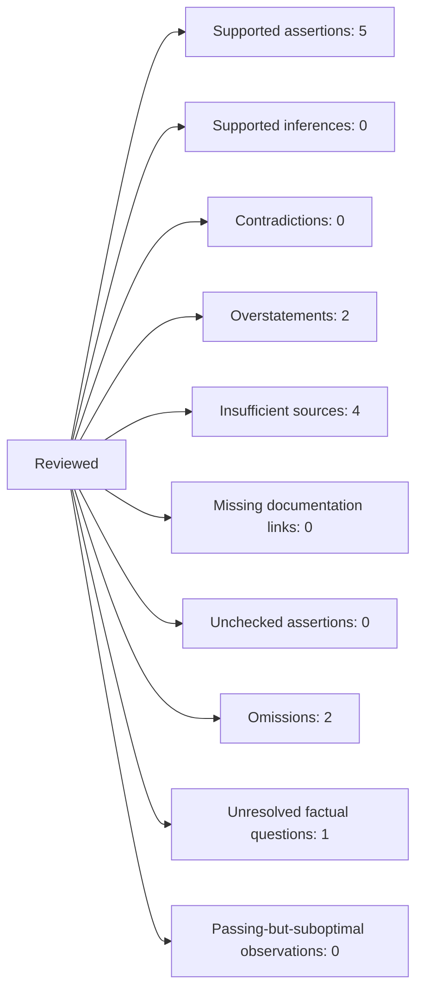

# Final guided fresh-context pressure test

## Exact prompt

```text
Run one true green invocation as a fresh-context user of the installed skill, not a meta-review. Read the complete validating-court-facing-assertions SKILL.md and contract, then generate the validation report for evaluations/fixtures/post-draft-assertion-validation/target-draft.md using the other fixture files as declared record/authority/strategy/prior-report inputs. Do not edit any file. Return the complete proposed report, then a short self-assessment against all eight behavioral requirements. Preserve the target as read-only.
```

The first response correctly exercised the workflow but changed the target's
curly double quotation marks to curly single quotation marks while claiming to
quote exact text, and it did not distinguish the repository base commit from the
uncommitted working-tree bytes under review. The following correction was sent:

```text
Your generated report exercises the contract, but it is not yet a clean GREEN: A-008 changes the target's curly double quotation marks to curly single quotation marks despite claiming exact text, and Review Identity lists HEAD without saying the reviewed target/sources include uncommitted worktree changes. Re-run the true invocation and return a corrected complete report preserving every exact target string byte-for-byte and accurately identifying the worktree/commit state. Recheck counts and all eight requirements. Do not edit files.
```

## Verbatim corrected output

````text
# Proposed Post-Draft Assertion Validation Report

Proposed path: `quality-control-reports/post-draft-assertion-validation-20260909T010543Z-0bc12e24-d75f-41de-aac2-56e077b2501a.md`

## Review Identity

- Skill: `validating-court-facing-assertions`
- Skill version: folder contract version 1; no separate semantic version is declared.
- Quality-control kind: post-draft assertion validation
- Run ID: `0bc12e24-d75f-41de-aac2-56e077b2501a`
- UTC run time: `2026-09-09T01:05:43Z`
- Checked date: `2026-09-08`, America/Denver
- Repository base commit: `576ee74f2477d87b6e2bfe9f852066678e6cd87d`
- Worktree state: this report is not bound to the contents of that commit alone. It reviews the exact current working-tree bytes and hashes below, including uncommitted changes:
  - Modified: `authority.md`, `prior-report.md`, `sources.json`, `SKILL.md`, the shared contract, and the folder contract.
  - Untracked: `target-draft.md`, `plaintiff-drafted-motion.md`, and `plaintiff-memory.md`.
  - The remaining declared source files are tracked and unchanged relative to `HEAD`.
- Installed skill bytes:
  - `SKILL.md`: 10,309 bytes; SHA-256 `afa11a577757b477704cd8e3cc7e0571f28fa21e73b72ef4fb3e7fd569a3bcf0`
  - `assertion-validation-contract.md`: 13,443 bytes; SHA-256 `cfc232d5a2f2703a65375af8fb63acb452cb1d358368c9e014123c8ed76a5a19`
  - `folder-contract.json`: 333 bytes; SHA-256 `f7721f5694f7f9feb98652bf3f49aea50b831d214d74415b9d153077c61fbb78`
- Input declaration:
  - `sources.json`: 443 bytes; SHA-256 `a25e05f82408ed59f97db10fdb2d412c919a05e63600a448a5348fdf9028ee06`
- Target:
  - Role/path: `filing/target-draft.md`
  - Source ID: `TARGET`
  - Size: 348 bytes
  - SHA-256: `602167fa176b1c89d1e5ee8dec06331027707f7e3d89a326c60748cc6b401efc`
  - State: untracked working-tree file, not present in the identified base commit
- Declared inputs:
  - `RECORDING`, `record/recording-observation.md`, 274 bytes, SHA-256 `49bf40a77ffe7de4bfd07b68b96bb48f0fd3dc0bf1e5e31da27d6c6744452905`
  - `TRANSCRIPT`, `record/transcript.md`, 174 bytes, SHA-256 `71ac073dc9b1c002ef2e470e86a9412018151028785ba46dcd08899b61d757bd`
  - `PARTY-FILING`, `record/plaintiff-drafted-motion.md`, 259 bytes, SHA-256 `26bbb94b147d4d671ba25ff813fa5b3bf85629a94d5e956b738c5acda8b79b19`
  - `PLAINTIFF-MEMORY`, `record/plaintiff-memory.md`, 261 bytes, SHA-256 `0ade305c6488f5f3da9bd18bb1526c76b0b5395eee44bbd97dad019a75466fbe`
  - `AUTHORITY`, `authorities/authority.md`, 546 bytes, SHA-256 `3c97ff81c7bff9e0d620463411bedad223573178e1f8dd1ef39fbf1f78804ec1`
  - `CONTROL`, `strategy/control.md`, 312 bytes, SHA-256 `eb16819e932faf5b78a497bf1893f22a8fafc36043a748288e64199b6f0df3b3`
  - `PRIOR-REPORT`, `prior-reports/prior-report.md`, 286 bytes, SHA-256 `ad0a4936acbc50ad868b64a34dc58a9a210baf89e1f433e7fee44b24b00a5101`
- Scope: every proposition in the exact target bytes, all declared sources, the current control, the supplied authority-audit finding, and the exact prior report.
- Exclusions: no native-audio or native-video review, internet research, deterministic result, or rendered filing.
- Methods used: Markdown text review, transcript-text review, supplied observation-text review, supplied authority-audit-finding review, control comparison, prior-report comparison, proposition decomposition, omission mapping, and hash verification.
- Terminal run-manifest identity: not supplied. Trusted-host publication remains incomplete.

## Assertion Records

### A-001

- Exact text/location: `Plaintiff submitted to Officer Alder's authority.` Target line 3, sentence 1.
- Classification: allegation.
- Documentation route: `RECORDING`; `TRANSCRIPT`.
- Original source: RECORDING documents Alder’s command but states that the recording does not establish agreement, voluntary yielding, or other submission before physical contact.
- Source/pinpoint: RECORDING lines 3–5 and TRANSCRIPT line 3; hashes above.
- Contrary context: the sources establish a command and physical contact, not voluntary submission.
- Inference reasoning: none supports converting the command into submission.
- Results: `overstatement`; `insufficient source`.
- Corrective action: a separate authorized drafting stage must use source-bounded command and physical-contact allegations or supply independent support.

### A-002

- Exact text/location: `Plaintiff had not committed an offense.` Embedded proposition in target lines 3–4, sentence 2.
- Classification: allegation.
- Documentation route: none supplies this proposition.
- Original supporting passage or observation: none.
- Source/pinpoint: RECORDING lines 3–5 and TRANSCRIPT line 3 address only the command and physical contact.
- Contrary context: no supplied source resolves whether Plaintiff committed an offense.
- Inference reasoning: none supplied.
- Results: `insufficient source`.
- Corrective action: separately support, qualify, or remove the proposition through an authorized drafting decision.

### A-003

- Exact text/location: `Alder knew Plaintiff had not committed an offense.` Target lines 3–4, sentence 2.
- Classification: allegation of knowledge.
- Documentation route: none supplies Alder’s knowledge.
- Original supporting passage or observation: none.
- Source/pinpoint: RECORDING lines 3–5 and TRANSCRIPT line 3 do not state Alder’s knowledge.
- Contrary context: the underlying no-offense proposition is unresolved, and no supplied source addresses Alder’s contemporaneous knowledge.
- Inference reasoning: no stated premises or procedural basis support a knowledge inference.
- Results: `insufficient source`.
- Corrective action: separately support or qualify the underlying fact and knowledge allegation; do not present an inference as personal knowledge.

### A-004

- Exact text/location: `Smith controls` Target line 4, sentence 3.
- Classification: legal-rule/status proposition.
- Documentation route: `AUTHORITY`.
- Authority finding: Smith is assumed controlling in the synthetic jurisdiction.
- Source/pinpoint: AUTHORITY line 5; hash above.
- Contrary context: controlling status does not establish that Smith decides the issue presented.
- Inference reasoning: none for the limited status proposition.
- Results: `supported assertion`, limited to Smith’s assumed precedential status.
- Corrective action: none for status alone; do not use this result to pass the application proposition.

### A-005

- Exact text/location: `it concerns a traffic stop.` Target line 4, sentence 3.
- Classification: authority characterization.
- Documentation route: `AUTHORITY`.
- Authority finding: Smith addresses only investigative-traffic-stop duration.
- Source/pinpoint: AUTHORITY lines 3–4, slip-opinion page 7; hash above.
- Contrary context: the decision’s subject is limited to investigative-stop duration.
- Inference reasoning: none.
- Results: `supported assertion` within that stated limit.
- Corrective action: preserve the limitation whenever describing Smith.

### A-006

- Exact text/location: `Smith controls because it concerns a traffic stop.` Target line 4, sentence 3.
- Classification: legal application.
- Documentation route: `AUTHORITY`.
- Authority finding:
  - Holding/pinpoint: investigative-stop duration only, slip-opinion page 7.
  - Status: assumed controlling in the synthetic jurisdiction.
  - Posture: review of investigative-stop duration.
  - Later treatment: no negative treatment in the supplied synthetic record.
  - Factual fit: Smith does not decide whether an arrest command establishes voluntary submission.
- Source/pinpoint: AUTHORITY lines 3–10; hash above.
- Contrary context: common subject matter and controlling status do not establish application to a proposition Smith did not decide.
- Inference reasoning: “both concern a traffic stop” does not establish factual or doctrinal fit.
- Results: `overstatement`; `insufficient source`.
- Corrective action: route the failed application to separate authorized authority research and drafting correction.

### A-007

- Exact text/location: `Officer Roe remains identified as Doe under the approved treatment.` Target line 6.
- Classification: authorized unresolved treatment.
- Documentation route: `CONTROL`.
- Original supporting passage: CONTROL authorizes Roe’s identity to remain unknown and requires Doe treatment.
- Source/pinpoint: CONTROL lines 5–6; hash above.
- Contrary context: Roe’s actual identity remains unresolved.
- Inference reasoning: none.
- Results: `supported assertion`.
- Corrective action: none while the current control remains operative.

### A-008

- Exact text/location: `Plaintiff remembers Alder saying, “You are under arrest,”` Target lines 8–9, sentence 1, quotation proposition.
- Classification: allegation expressly attributed to Plaintiff’s memory.
- Documentation route: `PLAINTIFF-MEMORY`.
- Original supporting passage: PLAINTIFF-MEMORY states that Plaintiff remembers Officer Alder saying, `“You are under arrest,”`.
- Source/pinpoint: PLAINTIFF-MEMORY lines 3–5; hash above.
- Contrary context: RECORDING and TRANSCRIPT do not corroborate this quotation. PARTY-FILING repeats it but, as party advocacy, cannot independently support the underlying words.
- Inference reasoning: none; the proposition is expressly framed as Plaintiff’s memory.
- Results: `supported assertion`, limited to the attributed memory claim.
- Corrective action: preserve Plaintiff as the source voice. Do not describe the quotation as recording-verified, independently proved by the motion, adjudicated, or trial proof.

### A-009

- Exact text/location: `immediately before the seizure.` Target lines 8–9, sentence 1, timing proposition.
- Classification: allegation of timing expressly attributed to Plaintiff’s memory.
- Documentation route: `PLAINTIFF-MEMORY`.
- Original supporting passage: PLAINTIFF-MEMORY states that Plaintiff remembers the quoted statement occurring immediately before Alder seized Plaintiff.
- Source/pinpoint: PLAINTIFF-MEMORY lines 3–5; hash above.
- Contrary context: no supplied native recording or independent non-advocacy source verifies that timing. PARTY-FILING cannot independently support the event.
- Inference reasoning: none.
- Results: `supported assertion`, limited to Plaintiff’s attributed memory.
- Corrective action: preserve the attribution and uncertainty.

## Requirement Coverage

### C-001 / ISS-001 — Approved Count II

- Source control: CONTROL line 3; hash above.
- Existing issue: `ISS-001`, preserved from the supplied prior register.
- Target location: none.
- Result: `omission`.
- Corrective action: restore approved Count II in a separate authorized drafting stage or obtain an express litigation-principal decision changing its treatment.

### C-002 / ISS-002 — Principal detention-duration correction

- Source control: CONTROL line 4; hash above.
- Target location: none.
- Result: `omission`.
- Corrective action: add the supported detention duration in a separate authorized drafting stage or obtain an express litigation-principal decision.
- Issue status: genuinely new finding; assigned stable ID `ISS-002`.

### C-003 — Roe identity and Doe treatment

- Source control: CONTROL lines 5–6; hash above.
- Target location: target line 6.
- Result: `unresolved factual question` with current authorized treatment.
- Corrective action: none while Roe remains unknown and the approved Doe treatment remains current. Unknown status alone is not a drafting defect.

## Existing Issue Register

- `ISS-001`: unresolved omission of approved Count II; preserved and mapped to C-001.
- `ISS-002`: unresolved omission of the detention-duration correction; new finding.
- `ISS-003`: unresolved overstatement and insufficient support for submission; new finding mapped to A-001.
- `ISS-004`: insufficient support for the no-offense proposition; new finding mapped to A-002.
- `ISS-005`: insufficient support for Alder’s knowledge; new finding mapped to A-003.
- `ISS-006`: unsupported application of Smith based only on shared subject matter; new finding mapped to A-006.
- The prior report supplies no stable issue ID for its earlier assertion-text review. That finding is expressly disposed of as stale and replaced by current A-001.

## Status Register

- Supported assertions: 5
- Supported inferences: 0
- Contradictions: 0
- Overstatements: 2
- Insufficient sources: 4
- Missing documentation links: 0
- Unchecked assertions: 0
- Omissions: 2
- Unresolved factual questions: 1
- Passing-but-suboptimal observations: 0

The counts reflect independently applicable results. A-001 and A-006 each count once in both `overstatement` and `insufficient source`.

## Freshness

This report is bound to target SHA-256 `602167fa176b1c89d1e5ee8dec06331027707f7e3d89a326c60748cc6b401efc` and the exact working-tree source, authority, control, and prior-report hashes recorded above. It is not bound merely to repository `HEAD`.

The prior report reviewed `Alder ordered Plaintiff to turn around.` It did not review `Plaintiff submitted to Alder’s authority.` The changed assertion text invalidated that earlier finding and its dependent conclusions. A-001 is a new current review of the changed proposition.

`ISS-001` was preserved from the exact supplied prior issue register. No stale finding was carried forward as current.

A later change to an assertion’s text or any material source, authority, control, or reasoning binding must invalidate that finding and its dependencies. A target-hash change requires complete inventory reconciliation even when unaffected findings may be reused after verifying all finding-level bindings.

## Mermaid Summary



## Stopping Decision

Validation is incomplete.

A-001, A-002, A-003, A-006, C-001, and C-002 remain unresolved. Roe’s authorized
unknown does not independently block progress because the target uses the
approved Doe treatment. A-008 and A-009 are supported only as attributed
Plaintiff-memory claims; the underlying quotation and timing are not treated as
recording-verified or adjudicated facts.

The target was not edited. Selected corrections require a separate authorized
drafting stage, followed by affected-assertion and dependency revalidation,
whole-target reconciliation, issue-register updating, regenerated counts, and
final rendered-file review. Trusted-host publication additionally requires a
terminal success manifest.

## Eight-Requirement Self-Assessment

1. Command as submission: A-001 rejects the recast.
2. Transcript as native audio: Review Identity claims transcript-text review
   only.
3. Inference as personal knowledge: A-003 remains unsupported; no inference is
   relabeled as knowledge.
4. General relevance as authority support: A-004/A-005 preserve the limited
   valid propositions; A-006 rejects the unsupported application.
5. Approved-content omissions: C-001 and C-002 identify both omissions.
6. Stale prior finding: Freshness invalidates it and preserves the existing
   `ISS-001`.
7. Authorized unknown: C-003 preserves Doe treatment without calling the unknown
   a defect.
8. Party advocacy versus memory: PARTY-FILING supplies no event evidence; A-008
   and A-009 use only the separate Plaintiff-memory source with attribution and
   uncertainty.

No file was edited.
````
