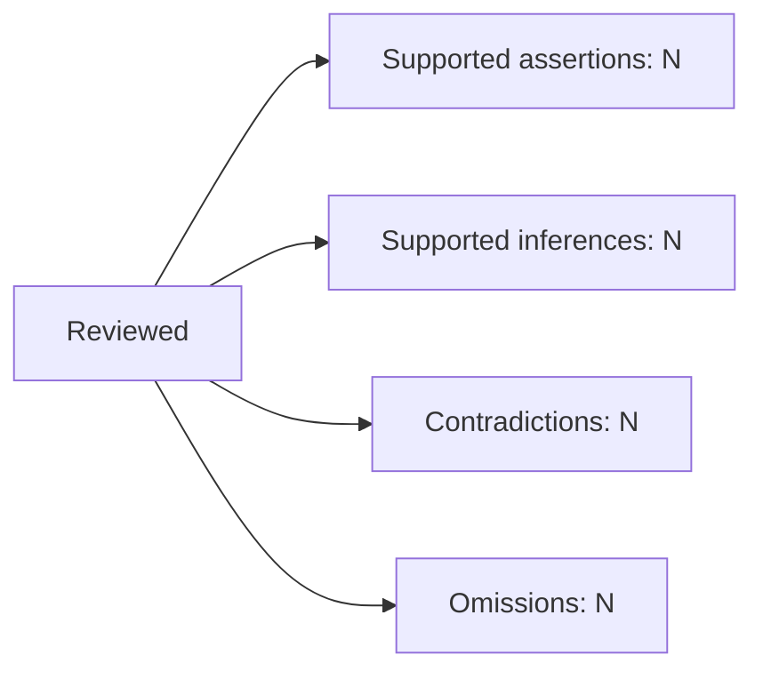

# Assertion-validation contract

Use this contract for one read-only post-draft validation of one explicit court-
facing target against declared original sources. The report is an audit of the
current candidate, not permission to edit it and not a substitute for the
litigation principal's decisions.

## Review identity

Record:

- skill name and version, quality-control kind, UTC run time, and run ID;
- reviewed commit when the filing is version-controlled;
- target role, relative path, byte size, and exact SHA-256;
- every reviewed source's role, relative path, source ID when supplied, and
  exact source hash;
- the identity, applicable control versions, and hash of each control;
- the complete review scope and any explicit exclusions;
- the methods actually used, such as native-video observation, native-audio
  listening, transcript review, PDF text review, image review, metadata review,
  authority audit, or deterministic check; and
- the terminal run-manifest identity supplied by the trusted host.

Never report a stronger method than the method actually used. Transcript review
is not native-audio verification. Extracted text review is not visual PDF
review. A source hash establishes byte identity, not the truth, meaning, or
legal effect of its content.

## Assertion inventory

Cover the complete target, including unchanged and inherited text. Treat every
independently falsifiable or supportable proposition as one assertion. Split a
compound sentence when its clauses assert different actors, conduct, times,
knowledge, causes, quotations, legal rules, applications, or results.

Assign stable IDs that can survive formatting changes while the exact
proposition remains unchanged. A paragraph, sentence, citation string, or
documentation route is not an indivisible assertion merely because it appears as
one unit in the document.

### Assertion record

Every assertion record contains:

- `assertion ID`;
- `exact text` and `location` in the reviewed target;
- `classification` as source fact, supported inference, allegation, attributed
  position, legal rule, legal application, procedural statement, requested
  relief, or other stated class;
- `documentation route` when one is actually supplied, including a CaseGraph
  route only when present in declared input;
- `original supporting passage or recording observation` stated exactly enough
  to reproduce the review;
- source identity, exact source hash, and `pinpoint`;
- material `contrary context`, qualifiers, and conflicting source passages;
- `inference reasoning`, including every premise and the procedural rule that
  permits the inference when applicable;
- `results` containing one or more independently applicable allowed statuses
  below; and
- `corrective action`, decision required, or reason no correction is needed.

Do not invent a documentation route. This skill does not depend on or require
CaseGraph. A missing documentation link and insufficient source support are
independent conditions.

## Substantive validation

For each proposition, test every applicable dimension against the original
source, not merely a summary or citation:

- actor;
- conduct;
- timing;
- duration;
- attribution and source voice;
- knowledge at the legally relevant time;
- personal participation and causation;
- quotation accuracy and omitted qualifying context; and
- degree of certainty.

An arrest command does not itself establish voluntary submission. A later report
does not itself establish earlier knowledge. An inference cannot be reported as
personal knowledge. A source that is related to the event does not support every
proposition about the event.

Record what each source establishes, what it does not establish, contrary
material, and whether the draft uses a stronger, broader, earlier, later, or
more certain proposition than the source supports.

### Party-drafted documents and Plaintiff memory

A party-drafted complaint, motion, response, brief, declaration draft, or other
advocacy document is never evidence for an underlying event or quoted words,
whether Plaintiff or the defense drafted it. It may establish its own text, the
procedural fact that it was filed, or an attributed party position. Do not use
its repetition of an event description or quotation to substantiate that event
or quotation.

Plaintiff's memory claims are an eligible independent source only when recorded
in a separate identified source document, distinct from the drafted court-facing
document under review and from other party advocacy. Record the memory source's
identity, hash, passage, and pinpoint; classify the supported proposition with
Plaintiff as its source voice and preserve all uncertainty and contrary context.
The separate document does not convert memory into an adjudicated fact or trial
proof.

When the only supplied support for an event or quotation is a party-drafted
document, record `insufficient source`. Separately assess whether that same
document supports an attributed-position or procedural assertion about the
party's own filing.

## Authority propositions

Use `audit-authorities` for every material authority proposition. Carry its
authority-specific findings into the assertion report. For each proposition,
record:

- the actual holding and exact supporting passage;
- pinpoint;
- controlling status or persuasive status in the governing jurisdiction;
- procedural posture and the proposition's use in the current posture;
- relevant later treatment and current validity;
- material factual fit, differences, and analogy limits; and
- the draft's application of the rule to the asserted facts.

If the required authority audit or a current authority-specific finding is
unavailable, record the proposition as an `unchecked assertion` and stop. Do not
substitute an abbreviated authority review inside this skill.

A real, published, or generally relevant decision does not support a proposition
it did not decide. Keep these uses separate:

- pre-event clearly established law and fair warning;
- defendant knowledge of event facts;
- municipal notice of a policy, custom, risk, or deficiency; and
- Rule 15(c) notice of the lawsuit.

Do not convert one kind of notice into another.

## Requirement and omission coverage

Build a coverage record from current declared controls and applicable drafting
contracts. Include every:

- approved claim and approved claim path;
- material source fact required for a complete or candid presentation;
- principal correction;
- Defendant-, actor-, act-, element-, defense-, remedy-, or requested-relief
  requirement imposed by the applicable drafting skill; and
- authorized unresolved issue and its exact approved treatment.

For each item, record its source control or contract, version or hash, exact
target location, result, and corrective action or decision required. If the
candidate does not contain the item and no current control authorizes its
treatment, record an omission.

An authorized unknown remains an unresolved factual question with authorized
treatment. Unknown status by itself is not a drafting defect. Do not invent an
identity, fact, date, source, theory, claim, or position to make the coverage
table look complete.

## Status register

Keep these result classes separate and report every class even when its count is
zero:

- `supported assertion`: the proposition is directly supported within the
  source's limits;
- `supported inference`: stated premises and reasoning support the proposition
  under the applicable posture, but the source does not state it directly;
- `contradiction`: an original source materially conflicts with the proposition;
- `overstatement`: the proposition is broader, more certain, or differently
  attributed than the source supports;
- `insufficient source`: supplied sources do not substantively resolve the
  proposition;
- `missing documentation link`: expected source documentation or an optional
  supplied route is absent, regardless of substantive support;
- `unchecked assertion`: review has not reached a reproducible result or a prior
  finding is stale;
- `omission`: an applicable approved or required item has no mapped target
  treatment;
- `unresolved factual question`: the factual record remains open, including an
  authorized unknown; and
- `passing-but-suboptimal observation`: support is adequate but a noncritical
  improvement is available.

Do not collapse a contradiction, overstatement, insufficient source, unchecked
assertion, omission, or unresolved principal decision into a general `pass`.
Report supported assertions and supported inferences separately.

## Mermaid summary

After the assertion and coverage records are complete, count each actual status
class and generate one Mermaid diagram from those counts. Use the report's
spelled-out class names and numeric counts. Do not invent counts, omit a nonzero
class, or use the diagram in place of the underlying records.

Example shape only:

Recalculate the diagram after every report change.

## Freshness and dependency invalidation

Bind the report to the exact target hash. Bind each finding to its exact
assertion text, every material source hash, controlling decision identity and
reviewed status, applicable control versions, and every reasoning premise. Treat
a finding as stale when one of its finding-level bindings changes. A changed
target hash triggers inventory reconciliation, but does not by itself invalidate
an unrelated finding whose assertion text and dependencies remain unchanged.

Invalidate the affected assertion and each dependent assertion, application,
coverage conclusion, diagram count, and document-level conclusion. A correction
to one assertion does not automatically invalidate unrelated findings, but an
unaffected finding may be reused only after verifying that its text, sources,
controls, authorities, premises, and application remain unchanged and still
apply.

Revalidate every corrected assertion and dependency. Then reconcile the entire
final candidate so every current assertion and requirement has exactly one
current disposition. Avoid unnecessary full source re-investigation when exact
bindings establish that a prior finding remains applicable.

## Correction loop and final review

This review stage returns findings only. A separately authorized drafting or
revision stage may apply a selected, source-supported correction. That editing
stage must not silently drop a claim or theory, weaken an approved theory,
invent facts, or relabel a failed check to close a finding. Any litigation-
principal choice remains unselected until the principal decides it.

After correction:

1. verify the new target hash and changed assertion inventory;
2. revalidate affected assertions and dependencies;
3. verify continued applicability before reusing other findings;
4. rebuild omission coverage and status counts;
5. regenerate the Mermaid summary; and
6. perform a final whole-document and rendered-file review, including visible
   text, headings, numbering, citations, cross-references, exhibits, pagination,
   truncation, and privacy treatment as applicable.

If adversarial review later produces an accepted correction, return through the
same separate editing and revalidation sequence before another downstream
review.

## Stopping criteria

Validation completes only with:

- no unchecked assertions;
- no unresolved drafting defects;
- no unauthorized omissions;
- every remaining factual unknown identified with its current authorized
  treatment;
- every reserved litigation decision either made by the principal or identified
  precisely with its available choices and consequences; and
- complete assertion and requirement coverage for the exact final candidate,
  followed by rendered-file review.

Pleading support is not trial proof. A supported allegation or inference does
not establish an adjudicated fact.

When unavailable evidence or a principal decision prevents progress, identify
the exact assertion or requirement, missing material, available choices, and
consequences. Stop instead of endlessly regenerating drafts. Never close a
finding by silently dropping approved material, changing strategy, inventing a
source or fact, or treating missing documentation as substantive disproof.

## Report persistence boundary

Every independent validation run produces one append-immutable receipt through
the trusted host. Preserve independently authored receipts.

When a project requires one stable private current report with Git history, the
trusted case controller owns that file. This skill may read one exact prior
report from the declared `prior-reports` role and return proposed updated bytes
for a separate authorized controller action. It does not overwrite the prior
report, mutate case controls, write into a repository, or convert a mutable
current report into an independent receipt.

Reuse the existing issue register from an exact supplied prior report. Preserve
each stable issue ID and unresolved entry; record an explicit disposition for a
corrected or otherwise resolved entry, and add a new stable issue ID only for a
genuinely new finding. Do not silently omit an entry or create a parallel issue
register that obscures its history.
